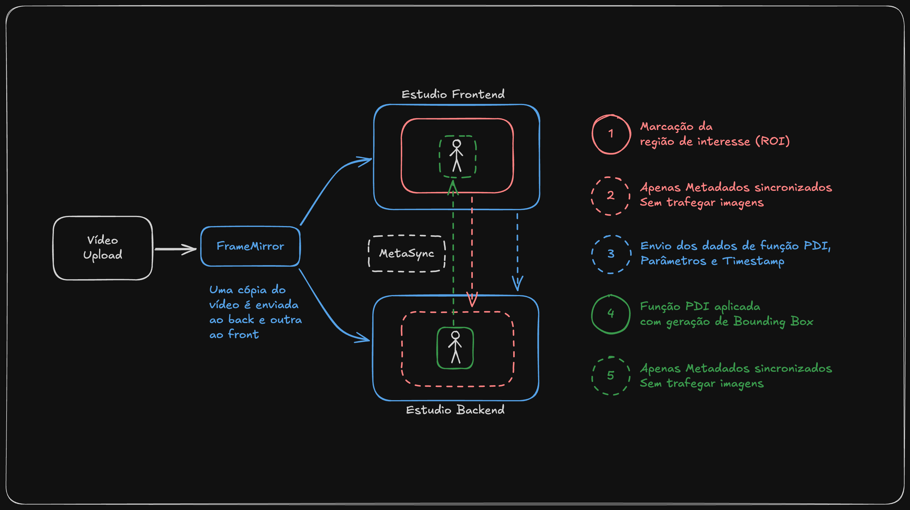

# Estúdio (de papelão) Frontend

O **Estúdio de Papelão** é uma aplicação desenvolvida para criar e testar projetos de visão computacional utilizando recursos avançados do OpenCV. O sistema é parte integrante da plataforma Soda Vision, fornecendo recursos de Processamento Digital de Imagens (PDI) e desenvolvimento de modelos personalizados. O nome "de papelão" reflete sua natureza como protótipo rápido e experimental, focado em validação de conceitos.

## Integração com Soda Vision

O Estúdio é um módulo da plataforma Soda Vision, que oferece duas principais vertentes de desenvolvimento:

### 1. Projetos PDI

- Desenvolvimento visual de soluções usando funções de processamento de imagens
- Configuração de áreas de interesse e funções específicas
- Teste e validação usando vídeos
- Exportação para execução em dispositivos de borda

### 2. Modelos Personalizados (Soda Vision)

- Treinamento de modelos de classificação customizados
- Interface intuitiva para upload e organização de datasets
- Processo simplificado de treinamento e validação
- Exportação dos modelos treinados

## Arquitetura

### Engine (Core)

A **Engine** é o núcleo compartilhado entre o Estúdio e o Runner, responsável por executar as funções de Processamento Digital de Imagens (PDI). Desenvolvida em Python com OpenCV, a Engine fornece:

- Biblioteca de funções PDI
- Gerenciamento de execução das funções
- Processamento otimizado de imagens e vídeos
- Interface padronizada para integração

### Estúdio

O **Estúdio** é a interface web onde os usuários podem desenvolver e testar seus projetos focados em PDI. Características principais:

- **Upload de Vídeo**: O usuário faz upload de um vídeo para teste, que é armazenado localmente no frontend e replicado no backend.
- **Interface Visual**: Permite marcar áreas de interesse (ROIs) no vídeo através de retângulos.
- **Configuração de Funções**: Para cada marcação de ROI, é possível atribuir funções como:
  - Segmentação de Cores
  - Detecção de Pessoas
  - Template Matching
  - Detecção de Formas
  - _(Novas funções serão adicionadas futuramente)_
- **Exportação**: Permite exportar as regras de inferência para serem executadas no Runner.

### Estúdio de Papelão

Apesar de ser desenhado para integrar no frontend do Soda Vision, o Estúdio Backend está em fase de testes e utiliza como frontend uma aplicação em outro repositório chamada **Estúdio de Papelão**. Trata-se de um frontend simplificado para testes, experimentações e validações do Estúdio como um todo.

### Runner

O **Runner** é o componente que executa em dispositivos de borda, aplicando as regras de inferência criadas no Estúdio em streams de vídeo em tempo real. Características:

- Executa localmente no dispositivo de borda
- Processa streams de câmeras em tempo real
- Utiliza a mesma Engine do Estúdio
- Otimizado para performance em dispositivos com recursos limitados

## FrameMirror e MetaSync

### FrameMirror

O **FrameMirror** é o componente que permite a sincronização entre o estado do vídeo no frontend e no backend do Estúdio. Em vez de trafegar imagens, o frontend envia apenas um JSON contendo:

- **Dados das marcações**: informações sobre as áreas de interesse
- **Funções atribuídas**: lista das funções PDI a serem aplicadas
- **Timestamp do frame atual**: momento específico do vídeo

### MetaSync

O **MetaSync** sincroniza os metadados entre frontend e backend, garantindo que as configurações de áreas de interesse e funções estejam alinhadas, proporcionando uma experiência fluida ao usuário.

## Tecnologias Utilizadas

### Frontend (Soda Vision)

- **React**: Framework principal
- **TypeScript**: Linguagem de desenvolvimento
- **Vite**: Build tool e desenvolvimento

### Backend

- **Python**: Linguagem base da Engine e backend
- **OpenCV**: Biblioteca core para PDI
- **FastAPI**: Framework web para a API do backend

## Como Executar

### Estúdio

1. Clone o repositório
2. Instale as dependências do frontend e backend
3. Configure as variáveis de ambiente
4. Inicie o servidor de desenvolvimento
5. Acesse o módulo do Estúdio na plataforma

### Runner

1. Instale o Runner no dispositivo de borda
2. Importe as regras ou modelos exportados do Estúdio
3. Configure as fontes de vídeo (câmeras)
4. Inicie o processamento

## Funções OpenCV Suportadas

### 1. Segmentação de Cor

- Definição de cores inferior e superior
- Ajuste de tolerância
- Configuração de área mínima/máxima

### 2. Detecção de Formas

- Seleção múltipla de formas (círculo, retângulo, triângulo)
- Ajuste de tolerância de forma
- Processamento em tempo real

### 3. Template Matching

- Upload de imagem de referência
- Configuração de limiar de correspondência
- Detecção em múltiplas escalas

### 4. Detecção de Pessoas

- Detecção automática de pessoas
- Configuração de parâmetros de detecção
- Marcação em tempo real
